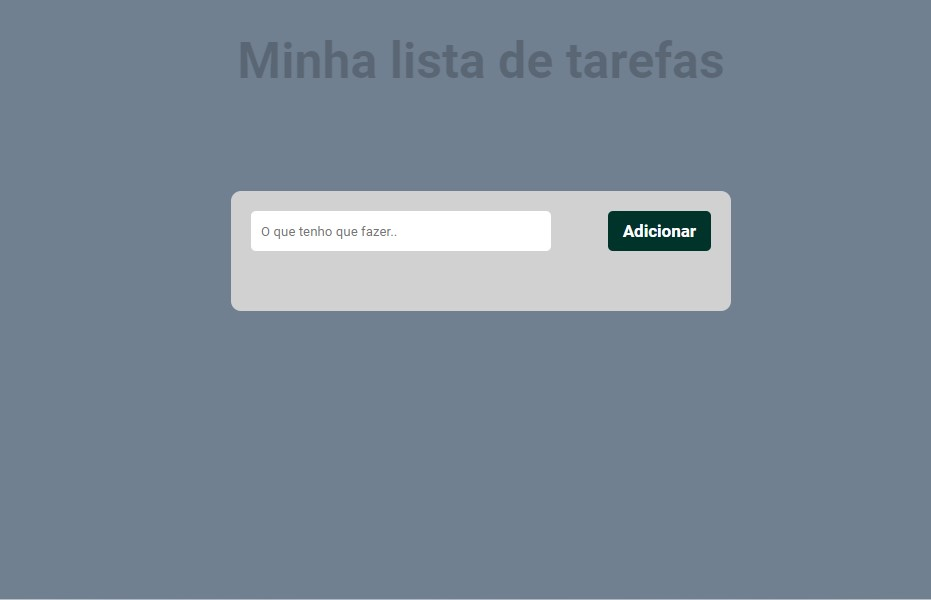

# To do List
<h1 align="center"> Apresentação </h1>

  <a href="#-tecnologias">Tecnologias</a>&nbsp;&nbsp;&nbsp;|&nbsp;&nbsp;&nbsp;
  <a href="#-projeto">Projeto</a>&nbsp;&nbsp;&nbsp;

 

  

 

## 🚀 Tecnologias

Esse projeto foi desenvolvido com as seguintes tecnologias:

- HTML e CSS
- JavaScript
- Git e Github

## 💻 Projeto

O Todo List é um projeto desenvolvido com mentoria do Rodolfo Mori, atravez de video aula no youtube com o intuito de aprender novas tecnologias.

- [Acesse o projeto finalizado, online](https://projtodolist.netlify.app/)